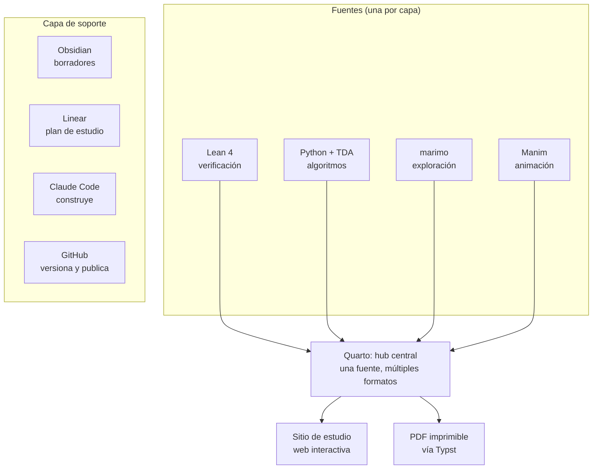

# Infraestructura de producción de conocimiento: documento de contexto y guía de la Fase 0

> **Para Claude Code:** este documento resume una conversación de planificación mantenida en claude.ai y contiene la guía de instalación de la Fase 0. Leelo completo antes de actuar. Describe quién es el usuario, qué estamos construyendo, por qué, con qué herramientas, cómo se organiza el repositorio y qué convenciones seguir. Las secciones 5, 6 y 7 son las más importantes para el trabajo diario. La sección 12 contiene una plantilla de `CLAUDE.md` para dejar en la raíz del repositorio.

**Versión:** 1.0 · **Fecha:** 2 de octubre de 2026 · **Idioma de trabajo:** español

---

## Índice

1. [Quién es el usuario](#1-quién-es-el-usuario)
2. [El origen: una tesis sobre los medios de conocimiento](#2-el-origen-una-tesis-sobre-los-medios-de-conocimiento)
3. [La visión: una infraestructura de nivel "Tier 1"](#3-la-visión-una-infraestructura-de-nivel-tier-1)
4. [Las seis capas del stack](#4-las-seis-capas-del-stack)
5. [El proyecto piloto: *Computational Topology*](#5-el-proyecto-piloto-computational-topology)
6. [Arquitectura del sistema](#6-arquitectura-del-sistema)
7. [Flujo de trabajo y roles de cada herramienta](#7-flujo-de-trabajo-y-roles-de-cada-herramienta)
8. [Principios y convenciones](#8-principios-y-convenciones)
9. [Fase 0: guía de instalación completa en WSL2](#9-fase-0-guía-de-instalación-completa-en-wsl2)
10. [Lista de verificación de la Fase 0](#10-lista-de-verificación-de-la-fase-0)
11. [Fase 1: el corte vertical (sección I.1)](#11-fase-1-el-corte-vertical-sección-i1)
12. [Plantilla de `CLAUDE.md`](#12-plantilla-de-claudemd)
13. [Decisiones pendientes](#13-decisiones-pendientes)
14. [Glosario de herramientas](#14-glosario-de-herramientas)

---

## 1. Quién es el usuario

**Esteban** es estudiante de Matemática en la Universidad Nacional de La Plata (Argentina) y trabaja en finanzas cuantitativas, donde construye herramientas cuantitativas en Python. Es matemático y programador, y lleva adelante varios proyectos en paralelo:

- finanzas cuantitativas (una estrategia de inversión cuantitativa propia),
- modelado y simulación de física,
- criptografía y criptoanálisis,
- diseño de modelos matemáticos.

**Herramientas que ya usa:** VS Code, Cursor, Antigravity, Git, GitHub, GitLab, Linear, Python, C++, R, LaTeX, React, Mermaid, Graphviz (`.dot`), y varios gestores de conocimiento (Obsidian, AFFiNE, Logseq, Anytype, Notion).

**Entorno de trabajo:** notebook con Windows; trabaja dentro de **WSL2** (Ubuntu).

**Cómo le gusta trabajar:** busca nivel profesional y de vanguardia, explicaciones profundas (no superficiales), y una infraestructura coordinada donde cada pieza tenga un rol claro. Valora entender el *porqué* de cada decisión, no solo el *cómo*.

---

## 2. El origen: una tesis sobre los medios de conocimiento

La conversación partió de una observación histórica de Esteban: la humanidad fue creando tecnologías de almacenamiento y transmisión de conocimiento cada vez más sofisticadas (el libro, el cine, la televisión, internet, el software especializado, los videojuegos, la realidad virtual, los asistentes de IA), y cada nueva tecnología permitió **replantear temas antiguos desde experiencias nuevas**. Sus ejemplos:

- La alegoría de la caverna de Platón: del texto a la realidad virtual.
- El mito de Prometeo: de la *Biblioteca* de Apolodoro a *Frankenstein* de Mary Shelley y a *Alien: Covenant*.
- La guerra: de Tucídides y Heródoto al cine (*1917*, *La caída del halcón negro*) y a videojuegos hiperrealistas como *Bodycam*.
- El estudio de la matemática: de libros monocromáticos densos a simuladores, visualización 3D y entornos interactivos.

**La conclusión que extrajimos:** cada medio nuevo no solo *presenta mejor* un tema viejo, sino que habilita una forma distinta de *pensarlo*. La caverna en realidad virtual no se lee: se habita. Por lo tanto, el stack tecnológico debe organizarse según **qué relación con el conocimiento habilita cada formato**, no como una colección de herramientas.

**El objetivo de Esteban:** construir un stack tecnológico que le permita diseñar y desarrollar sus propios productos de conocimiento (en matemática, física, programación, criptografía y finanzas cuantitativas) con un diferencial notable. Un "alpha", en sus palabras.

---

## 3. La visión: una infraestructura de nivel "Tier 1"

Esteban describe la meta como una infraestructura tecnológica coordinada "al estilo fuerza especial Tier 1" para su mundo profesional. Esto se traduce en tres tesis de diseño que guían todo el proyecto.

### Tesis 1: una sola fuente de verdad, múltiples formatos

Un mismo contenido (un modelo, un algoritmo, un teorema) vive **una sola vez** en el repositorio, y desde ahí se genera automáticamente en todos los formatos: documento web interactivo, PDF, animación, aplicación interactiva y, cuando corresponde, núcleo verificado formalmente. Un cambio en la fuente se propaga a todo. Muy poca gente trabaja así: es el núcleo del diferencial.

### Tesis 2: el formato se elige según la naturaleza del conocimiento

| Tipo de conocimiento | Formato que pide |
|---|---|
| Una demostración | Verificación formal (Lean) y exposición rigurosa |
| Un algoritmo | Implementación propia, testeada |
| Un sistema dinámico o un proceso | Simulación manipulable o animación |
| Una intuición geométrica | Visualización interactiva o animación |
| Una estrategia o un modelo aplicado | Un instrumento con datos reales (app, dashboard) |

El error común es meter todo en un solo formato (todo en notebooks, todo en Notion).

### Tesis 3: proyectos coordinados que se alimentan entre sí

El plan de fondo es mantener **múltiples proyectos coordinados**. El estudio de topología computacional (proyecto piloto) sirve a la vez para: (a) aprender la disciplina, (b) probar y depurar la infraestructura, y (c) nutrir el proyecto de finanzas cuantitativas con herramientas de análisis topológico de datos (TDA).

---

## 4. Las seis capas del stack

Este es el mapa completo de tecnologías propuesto. No todo se instala en la Fase 0: ver la sección 9.

### Capa 1. Matemática verificada

- **Lean 4 + Mathlib:** demostraciones verificadas por máquina.
- **leanblueprint** (Patrick Massot): documento LaTeX navegable con grafo de dependencias entre resultados (verde = demostrado, azul = pendiente).
- **Verso:** sistema de documentación de Lean.
- Para criptografía (futuro): EasyCrypt, CryptoVerif, Tamarin, ProVerif, Cryptol/SAW.

**Advertencia para este proyecto:** Mathlib cubre bien teoría de grafos y combinatoria, pero la homología simplicial está formalizada solo parcialmente y la homología persistente casi no existe. **Lean se usa de forma selectiva**, con resultados accesibles del libro, sin convertirlo en un cuello de botella.

### Capa 2. Documentos computacionales

- **Quarto:** el hub central. Desde una fuente Markdown con código genera sitio web, PDF, libro, slides.
- **Typst:** sistema tipográfico moderno (alternativa a LaTeX); viene incluido en Quarto.
- **marimo:** notebooks reactivos de Python, guardados como `.py` puros (versionables en Git), exportables a HTML/WebAssembly.
- MyST / Jupyter Book: alternativa para libros técnicos (no se usa por ahora).

### Capa 3. Visualización y explicaciones explorables

- **Manim (Community Edition):** animación matemática precisa (la librería de 3Blue1Brown).
- **Observable JS, D3, Three.js:** figuras interactivas dentro de Quarto (vienen por CDN, no se instalan).
- **Penrose:** diagramas generados a partir de notación matemática (opcional, futuro).
- Motion Canvas, MathBox, GeoGebra, Desmos: alternativas puntuales.

### Capa 4. Simulación y cálculo numérico

- **NumPy, SciPy:** base.
- **JAX:** cálculo diferenciable con GPU (más adelante).
- Julia + SciML, NVIDIA Warp, Taichi: para simulación física (otros proyectos).
- Godot, Unreal, WebXR: experiencias inmersivas (horizonte lejano).

### Capa 5. Herramientas especializadas

- **TDA:** GUDHI, ripser, persim, giotto-tda, networkx.
- Finanzas: QuantLib, vectorbt, NautilusTrader; dashboards con Streamlit, Panel o Shiny for Python.
- Criptografía: SageMath; pruebas de conocimiento cero con Circom, Noir, halo2.

### Capa 6. Infraestructura y capa de IA

- **uv:** gestor de Python y dependencias (ver glosario).
- **Git + GitHub + GitHub Actions + GitHub Pages:** versionado, compilación y publicación automáticas.
- **Claude Code:** agente que construye dentro del repositorio.
- **MCP (Model Context Protocol):** conecta a Claude con herramientas externas (Linear, sistema de archivos, etc.).
- Nix / devcontainers: entornos reproducibles (opcional, futuro).

---

## 5. El proyecto piloto: *Computational Topology*

### 5.1 El libro

**Herbert Edelsbrunner y John L. Harer, *Computational Topology: An Introduction*, American Mathematical Society, 2010.**

Es un libro pensado para enseñar: cada capítulo desarrolla un tema mayor (unas dos semanas de curso) y está dividido en secciones con ejercicios. Tiene tres partes y nueve capítulos:

| Parte | Capítulo | Secciones |
|---|---|---|
| **A. Topología geométrica computacional** | I. Grafos | I.1 Componentes conexas · I.2 Curvas en el plano · I.3 Nudos y enlaces · I.4 Grafos planares |
| | II. Superficies | II.1 Variedades 2-dimensionales · II.2 Búsqueda en una triangulación · II.3 Autointersecciones · II.4 Simplificación de superficies |
| | III. Complejos | III.1 Complejos simpliciales · III.2 Sistemas de conjuntos convexos · III.3 Complejos de Delaunay · III.4 Complejos alfa |
| **B. Topología algebraica computacional** | IV. Homología | IV.1 Grupos de homología · IV.2 Reducción de matrices · IV.3 Homología relativa · IV.4 Sucesiones exactas |
| | V. Dualidad | V.1 Cohomología · V.2 Dualidad de Poincaré · V.3 Teoría de intersección · V.4 Dualidad de Alexander |
| | VI. Funciones de Morse | VI.1 Funciones suaves genéricas · VI.2 Transversalidad · VI.3 Funciones lineales a trozos · VI.4 Grafos de Reeb |
| **C. Topología persistente computacional** | VII. Persistencia | VII.1 Homología persistente · VII.2 Implementaciones eficientes · VII.3 Persistencia extendida · VII.4 Sucesiones espectrales |
| | VIII. Estabilidad | VIII.1 Familias 1-paramétricas · VIII.2 Teoremas de estabilidad · VIII.3 Longitud de una curva · VIII.4 Emparejamiento en grafos bipartitos |
| | IX. Aplicaciones | IX.1 Datos de expresión génica · IX.2 Acoplamiento de proteínas · IX.3 Segmentación de imágenes · IX.4 Arquitectura de raíces |

Según los propios autores, la Parte C (persistencia y estabilidad) es la novedad y la razón de ser del libro.

**Importante:** el PDF del libro es material con derechos de autor. **Nunca se commitea al repositorio** (va en `.gitignore`). El producto contiene la disección propia de Esteban, sus implementaciones y sus visualizaciones, no el texto del libro.

### 5.2 Por qué este libro es ideal como piloto

1. **Es algorítmico:** casi cada concepto termina en un algoritmo implementable (union-find, reducción de matrices, persistencia).
2. **Es geométrico:** filtraciones, complejos de Čech, Vietoris–Rips, Delaunay y alfa piden visualización y animación.
3. **Conecta con finanzas:** la Parte C es la base del análisis topológico de datos (TDA) que se usa en finanzas cuantitativas.

### 5.3 Puentes hacia finanzas cuantitativas

Estos son algunos puntos de contacto entre el libro y el proyecto financiero, para tener presentes durante el estudio:

- **I.1 (componentes conexas, union-find) → persistencia en dimensión 0.** El clustering jerárquico de enlace simple (*single linkage*) sobre una matriz de correlaciones de activos es exactamente persistencia 0-dimensional, y se calcula con union-find. Se relaciona con los árboles de expansión mínima de correlaciones (Mantegna).
- **III (complejos simpliciales, Vietoris–Rips) → nubes de puntos financieras.** Ventanas deslizantes de retornos vistas como nubes de puntos (*embeddings* de Takens).
- **VII (persistencia) → detección de cambios de régimen.** Normas de paisajes de persistencia (*persistence landscapes*) como indicadores tempranos de crisis.
- **VIII (estabilidad) → robustez.** Los teoremas de estabilidad garantizan que pequeñas perturbaciones en los datos (ruido de mercado) producen pequeños cambios en los diagramas. Es la justificación matemática de usar TDA sobre datos ruidosos.
- **VI.4 (grafos de Reeb) → Mapper.** El algoritmo Mapper, usado para segmentar mercados y activos, es una versión discreta de los grafos de Reeb.

Cada capítulo del producto puede terminar con una sección "Puente a finanzas" que registre estas conexiones.

---

## 6. Arquitectura del sistema

### 6.1 Visión general



**Idea central:** un único repositorio Git donde cada herramienta produce una pieza, y **Quarto** las compila en un sitio web de estudio centralizado. Ese sitio es la plataforma única donde se estudia el producto completo.

### 6.2 Por qué Quarto es el hub

Quarto integra todas las piezas de forma nativa:

- Ejecuta código Python dentro de los capítulos (`.qmd`) y muestra los resultados: gráficos, diagramas de persistencia, tablas.
- Soporta **Observable JS** (con D3 y Three.js) sin configuración extra, para figuras interactivas.
- Incrusta videos (Manim) y páginas HTML (apps de marimo exportadas).
- Renderiza diagramas Mermaid y Graphviz, y matemática con MathJax.
- Compila la misma fuente a PDF vía Typst o LaTeX.
- Con `freeze`, guarda los resultados de la ejecución de código para no recalcular en cada compilación (clave para la integración continua).

### 6.3 Estructura del repositorio

```
topologia-computacional/
├── CLAUDE.md                  # Arquitectura y convenciones (para Claude Code)
├── README.md
├── _quarto.yml                # Configuración del sitio
├── index.qmd                  # Portada y mapa del libro
├── capitulos/
│   ├── 01-grafos/
│   │   ├── index.qmd          # Introducción y mapa del capítulo
│   │   ├── 1-1-componentes-conexas.qmd
│   │   ├── ejercicios.qmd
│   │   └── media/             # Videos renderizados de Manim, imágenes
│   ├── 02-superficies/
│   └── ...                    # Un directorio por capítulo (I a IX)
├── src/tcomp/                 # Librería Python propia: implementaciones del libro
│   ├── __init__.py
│   ├── union_find.py
│   ├── complejos.py
│   ├── homologia.py
│   └── persistencia.py
├── tests/                     # Tests: implementaciones propias vs. librerías de referencia
├── notebooks/                 # Apps de exploración en marimo (.py)
├── animaciones/               # Escenas de Manim (.py)
├── lean/                      # Proyecto Lean (lake) con formalizaciones selectas
├── _freeze/                   # Resultados congelados de Quarto (SÍ se commitea)
├── pyproject.toml             # Dependencias Python (gestionadas con uv)
├── uv.lock                    # Versiones exactas (SÍ se commitea)
├── .python-version
├── .gitignore
└── .github/workflows/publicar.yml
```

### 6.4 Dónde vive cada cosa físicamente

| Elemento | Ubicación | Motivo |
|---|---|---|
| Repositorio | `~/proyectos/topologia-computacional` (sistema de archivos de Linux en WSL2) | Rendimiento: compilar desde WSL sobre archivos de Windows (`/mnt/c/...`) es mucho más lento |
| PDF del libro | `~/proyectos/topologia-computacional/libro/` (ignorado por Git) o `~/libros/` | Acceso local para Claude Code, nunca publicado |
| Vault de Obsidian | Lado Windows, por ejemplo `C:\Users\<usuario>\Obsidian\Topologia` | Obsidian es una app de Windows. Desde WSL se accede en `/mnt/c/Users/<usuario>/Obsidian/Topologia` |
| VS Code | Instalado en Windows, conectado a WSL con la extensión WSL | Editor en Windows, ejecución en Linux |
| Claude Code | Instalado dentro de WSL2 | Corre nativamente en Linux junto a Quarto, Manim, Lean |
| Sitio publicado | GitHub Pages (rama `gh-pages`) | Accesible desde cualquier dispositivo |

---

## 7. Flujo de trabajo y roles de cada herramienta

### 7.1 Los tres espacios de trabajo con Claude

Durante la conversación se aclaró una distinción importante entre productos de Anthropic:

| Espacio | Qué es | Acceso a archivos locales | Rol en este proyecto |
|---|---|---|---|
| **Proyecto de chat en claude.ai** ("Nuevas tecnologías de producción de conocimiento") | Chat con conocimiento adjunto (el PDF del libro) | No. Solo lee los archivos adjuntos, en modo lectura | **Estudio y diseño:** leer el libro, discutir conceptos y demostraciones, decidir qué construir |
| **Claude Code** (dentro de WSL2) | Agente en terminal/VS Code que trabaja en el repositorio | Sí, lectura y escritura en el repo; ejecuta comandos | **Constructor principal:** crea archivos, instala dependencias, corre tests, compila, hace commits |
| **Claude Cowork** (app de escritorio de Windows) | Agente con la misma arquitectura que Claude Code, sin terminal; trabaja sobre carpetas locales conectadas | Sí, en las carpetas conectadas. Un proyecto de Cowork puede vincular proyectos de chat de claude.ai | Alternativa conversacional. **Pendiente de prueba:** no está confirmado que funcione bien con carpetas dentro de WSL (`\\wsl.localhost\...`) |

**Decisión:** Claude Code en WSL2 es el constructor principal. Cowork queda como opción a evaluar.

### 7.2 El ciclo de trabajo por sección del libro

```
1. ESTUDIO (proyecto de chat en claude.ai)
   Leer la sección con Claude, discutir definiciones, demostraciones, ejemplos.
   Diseñar qué piezas construir (qué implementar, qué animar, qué formalizar).
        │
        ▼
2. CAPTURA (Obsidian)
   Notas crudas, dudas, conexiones, ideas para finanzas. Desordenado a propósito.
        │
        ▼
3. CONSTRUCCIÓN (Claude Code en el repositorio)
   Implementar en src/tcomp/ + tests · animación en animaciones/ ·
   exploración en notebooks/ · formalización en lean/ · capítulo en capitulos/
        │
        ▼
4. DESTILACIÓN (Quarto)
   Promover el conocimiento maduro de Obsidian al capítulo .qmd, integrando
   todas las piezas. Compilar y revisar localmente con `quarto preview`.
        │
        ▼
5. PUBLICACIÓN (Git + GitHub Actions)
   Commit y push → la Action recompila y publica en GitHub Pages.
        │
        ▼
6. SEGUIMIENTO (Linear)
   Mover el issue de la sección al estado correspondiente.
```

### 7.3 Obsidian: cuaderno de laboratorio, no producto final

- **Obsidian** = pensamiento en bruto: rápido, desordenado, conexiones tentativas.
- **Quarto** = publicación: conocimiento destilado, verificado y bien presentado.
- El flujo es *capturar en Obsidian → destilar → promover a Quarto*. Como ambos usan Markdown, la promoción es casi copiar y pegar (adaptando los `[[wikilinks]]` de Obsidian a referencias cruzadas de Quarto).
- Se recomendó **consolidar los gestores de conocimiento en Obsidian** para este flujo, en lugar de mantener cinco en paralelo.
- Claude Code puede leer las notas del vault desde WSL (`/mnt/c/...`) cuando se le pida explícitamente.

### 7.4 Linear: centro de comando

Estructura propuesta:

- **Proyecto:** "Topología Computacional".
- **Un issue por sección del libro** (36 secciones), agrupados por capítulo (por ejemplo, con etiquetas o hitos `Cap. I`, `Cap. II`, …).
- **Estados del flujo:** `Por leer` → `Leído` → `Entendido` → `Implementado` → `Publicado`.
- Issues adicionales para infraestructura (por ejemplo, "Fase 0: instalación") y para los puentes a finanzas.

Linear puede conectarse a Claude Code por MCP para que el agente lea y actualice issues (ver sección 9.11).

### 7.5 Convenciones de Git

- Rama principal: `main`. Cada push a `main` publica el sitio.
- Commits pequeños y descriptivos, en español, con prefijo de área. Ejemplos:
  - `cap1: disección de la sección I.1`
  - `tcomp: implementación de union-find con compresión de caminos`
  - `anim: animación de unión de componentes`
  - `lean: lema de los apretones de manos`
  - `infra: workflow de publicación`
- Para trabajo grande o experimental, ramas cortas (`feat/persistencia-0d`) y merge a `main`.

---

## 8. Principios y convenciones

1. **Implementación propia + validación profesional.** Los algoritmos del libro se implementan a mano en `src/tcomp/`. En `tests/` se comparan contra librerías de referencia (GUDHI, ripser, networkx). Implementar con las propias manos es la forma más profunda de entender; contrastar contra GUDHI garantiza la corrección. La librería resultante se reutiliza en el proyecto de finanzas.
2. **La comprensión manda sobre la herramienta.** Cada pieza del producto debe servir para entender algo mejor. Si una visualización o formalización no aporta comprensión, no se hace.
3. **Instalación incremental.** No se instala todo el primer día. Se suman capas cuando el contenido las pide.
4. **Lean selectivo.** Se formalizan resultados accesibles y valiosos, no el libro entero.
5. **Reproducibilidad total.** `uv.lock` y `_freeze/` se commitean. El sitio debe compilar igual en cualquier máquina y en la integración continua.
6. **El libro nunca se publica.** Ni el PDF ni fragmentos extensos del texto. Se escribe disección propia: reformulaciones, ejemplos, demostraciones desarrolladas, implementaciones y visualizaciones.
7. **Idioma.** Contenido del producto, comentarios y commits en español. La notación matemática sigue al libro.
8. **Cada capítulo del producto** sigue, en lo posible, esta estructura: motivación e intuición → definiciones y resultados (disección) → algoritmo e implementación → visualización → ejercicios resueltos → puente a finanzas → notas para formalización.

---

## 9. Fase 0: guía de instalación completa en WSL2

**Objetivo de la Fase 0:** dejar funcionando el pipeline completo (repositorio → compilación → publicación) con una página de prueba, **antes** de escribir contenido real. Si algo falla, falla ahora y no en medio del estudio.

**Convención de esta guía:** los bloques marcados *PowerShell* se ejecutan en Windows; todo lo demás, en la terminal de Ubuntu (WSL2).

> **Cambio respecto de lo conversado en el chat:** en la conversación se mencionó TinyTeX para LaTeX. Para WSL2 conviene más instalar TeX Live desde `apt`, porque Manim necesita paquetes de LaTeX que TinyTeX no trae por defecto. Así hay una sola instalación de LaTeX que sirve para Manim, leanblueprint y Quarto.

### 9.1 Verificar o instalar WSL2 con Ubuntu

*PowerShell (como administrador):*

```powershell
wsl --list --verbose
```

Si Ubuntu ya aparece con `VERSION 2`, pasar a 9.2. Si no:

```powershell
wsl --install -d Ubuntu-24.04
```

Reiniciar si lo pide, abrir "Ubuntu" desde el menú Inicio y crear el usuario de Linux. Si una distribución existente aparece con `VERSION 1`, convertirla (Claude Code no soporta WSL1):

```powershell
wsl --set-version Ubuntu-24.04 2
```

**Opcional, recomendado:** limitar o ampliar los recursos de WSL creando `C:\Users\<usuario>\.wslconfig`:

```ini
[wsl2]
memory=8GB
processors=4
```

(Ajustar a la máquina. Luego `wsl --shutdown` en PowerShell para aplicar.)

### 9.2 Actualizar Ubuntu e instalar dependencias del sistema

```bash
sudo apt update && sudo apt upgrade -y

# Herramientas básicas de compilación y utilidades
sudo apt install -y build-essential git curl wget unzip pkg-config

# Dependencias de Manim (Cairo, Pango) y ffmpeg para video
sudo apt install -y python3-dev libcairo2-dev libpango1.0-dev ffmpeg

# LaTeX (para Manim, leanblueprint y PDFs vía LaTeX)
sudo apt install -y texlive texlive-latex-extra texlive-fonts-recommended \
                    texlive-science cm-super dvisvgm
```

La instalación de TeX Live ocupa alrededor de 1 a 2 GB y tarda unos minutos.

### 9.3 Configurar Git y GitHub

```bash
git config --global user.name "Esteban <Apellido>"
git config --global user.email "<email-de-github>"
git config --global init.defaultBranch main
git config --global core.autocrlf input   # evita problemas de fin de línea con Windows

# CLI de GitHub
sudo apt install -y gh
gh auth login    # elegir GitHub.com → SSH → generar clave nueva → login por navegador
```

`gh auth login` genera y registra la clave SSH automáticamente. (La versión de `gh` en los repositorios de Ubuntu puede no ser la última; para la más reciente, ver https://github.com/cli/cli#installation.)

Verificar:

```bash
ssh -T git@github.com    # debe saludar con el nombre de usuario
```

### 9.4 VS Code conectado a WSL

1. Instalar VS Code **en Windows** (si no está).
2. Instalar la extensión **WSL** (`ms-vscode-remote.remote-wsl`) en Windows.
3. Desde la terminal de Ubuntu, en cualquier carpeta, ejecutar `code .`: la primera vez instala el servidor de VS Code dentro de WSL y abre una ventana conectada (abajo a la izquierda dice "WSL: Ubuntu").

Las extensiones de lenguaje se instalan **del lado WSL**. Desde la terminal de Ubuntu:

```bash
code --install-extension quarto.quarto
code --install-extension ms-python.python
code --install-extension marimo-team.vscode-marimo
code --install-extension myriad-dreamin.tinymist
code --install-extension leanprover.lean4
code --install-extension bierner.markdown-mermaid
```

| Extensión | Para qué |
|---|---|
| Quarto | Edición y vista previa de `.qmd` |
| Python | Lenguaje, depuración, entornos |
| marimo | Notebooks marimo dentro de VS Code |
| Tinymist | Soporte de Typst |
| Lean 4 | Editor interactivo de Lean |
| Markdown Mermaid | Vista previa de diagramas Mermaid |

### 9.5 Instalar uv (gestor de Python)

```bash
curl -LsSf https://astral.sh/uv/install.sh | sh
source ~/.bashrc     # o abrir una terminal nueva
uv --version
uv python install 3.12
```

**Qué es uv y por qué lo usamos:** es un gestor de proyectos y paquetes de Python escrito en Rust (de Astral). Reemplaza a `pyenv` (versiones de Python), `venv` (entornos virtuales), `pip` (instalación) y `pip-tools`/Poetry (fijado de versiones). Es entre 10 y 100 veces más rápido que pip y genera `uv.lock` con versiones exactas, de modo que `uv sync` reconstruye el mismo entorno en cualquier máquina. Comandos diarios:

| Comando | Acción |
|---|---|
| `uv add <paquete>` | Agrega una dependencia |
| `uv add --dev <paquete>` | Agrega una dependencia de desarrollo |
| `uv sync` | Reconstruye el entorno desde `uv.lock` |
| `uv run <comando>` | Ejecuta algo dentro del entorno del proyecto |

Se usa Python 3.12 (y no la última versión) por compatibilidad con librerías científicas como GUDHI y Manim.

### 9.6 Instalar Quarto

Consultar la última versión estable en https://quarto.org/docs/get-started/ y reemplazar el número:

```bash
QUARTO_VERSION=X.Y.Z    # reemplazar por la última versión estable
wget https://github.com/quarto-dev/quarto-cli/releases/download/v${QUARTO_VERSION}/quarto-${QUARTO_VERSION}-linux-amd64.deb
sudo apt install -y ./quarto-${QUARTO_VERSION}-linux-amd64.deb
rm quarto-${QUARTO_VERSION}-linux-amd64.deb

quarto --version
quarto check       # verifica LaTeX, Python, Jupyter
quarto typst --version   # Typst viene incluido
```

### 9.7 Instalar Claude Code dentro de WSL2

```bash
curl -fsSL https://claude.ai/install.sh | bash
# abrir una terminal nueva
claude --version
```

- **No usar `sudo`** con este instalador.
- Se instala y se ejecuta **dentro de la terminal de WSL**, no desde PowerShell.
- No requiere Node.js. Se actualiza solo en segundo plano.
- Requiere un plan pago de Claude (el plan gratuito no incluye Claude Code).
- La primera vez que se ejecuta `claude`, pide iniciar sesión.
- Documentación oficial: https://code.claude.com/docs/en/setup

Opcionalmente, instalar la extensión de Claude Code para VS Code; de todos modos, ejecutar `claude` en la terminal integrada de VS Code (conectada a WSL) funciona igual.

### 9.8 Crear el repositorio

```bash
mkdir -p ~/proyectos && cd ~/proyectos
mkdir topologia-computacional && cd topologia-computacional
git init

# Proyecto Python con estructura src/ y paquete "tcomp"
uv init --lib --name tcomp --python 3.12

# Dependencias del proyecto
uv add numpy scipy matplotlib networkx gudhi ripser persim marimo manim
uv add --dev pytest ruff jupyter

# Estructura de carpetas
mkdir -p capitulos/01-grafos/media tests notebooks animaciones docs libro .github/workflows
```

Copiar el PDF del libro a `libro/` (carpeta ignorada por Git). Desde WSL, una ruta de Windows como `C:\Users\<usuario>\Downloads\libro.pdf` se ve como `/mnt/c/Users/<usuario>/Downloads/libro.pdf`:

```bash
cp "/mnt/c/Users/<usuario>/Downloads/<archivo-del-libro>.pdf" libro/
```

Copiar **este mismo documento** al repositorio, para que Claude Code siempre lo tenga a mano:

```bash
cp "/mnt/c/Users/<usuario>/Downloads/contexto-proyecto.md" docs/contexto-proyecto.md
```

#### `.gitignore`

```gitignore
# Python
.venv/
__pycache__/
*.pyc
.pytest_cache/
.ruff_cache/

# Quarto (el sitio se genera; _freeze/ SÍ se versiona)
_site/
.quarto/

# Libro: material con derechos de autor, nunca se publica
libro/

# Salida cruda de Manim (los videos finales se copian a capitulos/*/media/)
/media/

# Lean
lean/.lake/

# Sistema
.DS_Store
Thumbs.db
```

#### `_quarto.yml`

```yaml
project:
  type: website
  output-dir: _site
  render:            # solo se compila lo listado (evita publicar docs/, README, CLAUDE.md)
    - index.qmd
    - capitulos/**/*.qmd

lang: es

website:
  title: "Topología Computacional"
  sidebar:
    style: docked
    search: true
    contents:
      - index.qmd
      - section: "Parte A · Topología geométrica computacional"
        contents:
          - capitulos/01-grafos/index.qmd

format:
  html:
    theme: cosmo
    toc: true
    html-math-method: mathjax
    code-fold: true
    code-tools: true

execute:
  freeze: auto       # guarda resultados en _freeze/ y solo recalcula lo que cambió
```

#### `index.qmd` (página de prueba del pipeline)

````markdown
---
title: "Topología Computacional"
subtitle: "Disección de Edelsbrunner & Harer"
---

Producto de conocimiento en construcción. Esta página verifica el pipeline.

## Prueba: homología persistente de un círculo con ruido

```{python}
import numpy as np
import gudhi
import matplotlib.pyplot as plt

rng = np.random.default_rng(0)
t = rng.uniform(0, 2 * np.pi, 60)
X = np.c_[np.cos(t), np.sin(t)] + rng.normal(0, 0.05, (60, 2))

st = gudhi.RipsComplex(points=X, max_edge_length=2.0).create_simplex_tree(max_dimension=2)
diagrama = st.persistence()
gudhi.plot_persistence_diagram(diagrama)
plt.show()
```

Debería verse un único punto de dimensión 1 lejos de la diagonal: el agujero del círculo.

## Prueba: figura interactiva con Observable JS

```{ojs}
viewof r = Inputs.range([0.1, 2], {value: 0.5, step: 0.05, label: "Radio"})
Plot.plot({
  aspectRatio: 1,
  x: {domain: [-2.5, 2.5]}, y: {domain: [-2.5, 2.5]},
  marks: [Plot.dot([[0, 0]], {r: r * 60, fill: "steelblue", fillOpacity: 0.3})]
})
```

## Prueba: diagrama Mermaid

```{mermaid}
flowchart LR
  A[Grafos] --> B[Complejos] --> C[Homología] --> D[Persistencia]
```
````

Crear también `capitulos/01-grafos/index.qmd` con un título simple (`title: "I. Grafos"`) para probar la navegación.

### 9.9 Pruebas de humo de cada capa

Cada prueba verifica que una pieza del stack funciona aislada.

**Quarto + Python + OJS + Mermaid:**

```bash
uv run quarto preview
```

Se abre el sitio en el navegador de Windows (WSL reenvía el puerto). Se usa `uv run` para que Quarto encuentre el Python del entorno del proyecto (`.venv`).

**Tests de Python** (`tests/test_humo.py`):

```python
import gudhi
import networkx as nx


def test_gudhi_funciona():
    st = gudhi.SimplexTree()
    st.insert([0, 1, 2])
    assert st.num_vertices() == 3


def test_networkx_componentes():
    G = nx.Graph([(0, 1), (2, 3)])
    assert nx.number_connected_components(G) == 2
```

```bash
uv run pytest
```

**Manim** (`animaciones/prueba.py`):

```python
from manim import Scene, Circle, MathTex, Create, Write, UP


class Prueba(Scene):
    def construct(self):
        c = Circle()
        f = MathTex(r"\chi = V - E + F").next_to(c, UP)
        self.play(Create(c), Write(f))
        self.wait()
```

```bash
uv run manim -ql animaciones/prueba.py Prueba
```

Genera un video en `media/videos/...` (calidad baja con `-ql`; usar `-qh` para la versión final). Si falla al renderizar la fórmula, revisar la instalación de TeX Live (9.2).

**marimo:**

```bash
uv run marimo edit notebooks/prueba.py
```

Abre el editor en el navegador. Crear una celda con un `mo.ui.slider` para comprobar la reactividad.

**Typst (PDF):**

```bash
uv run quarto render index.qmd --to typst
```

### 9.10 Publicación en GitHub Pages

**1. Crear el repositorio remoto y subir el código:**

```bash
git add .
git commit -m "infra: estructura inicial y pruebas de humo"
gh repo create topologia-computacional --public --source=. --remote=origin --push
```

> GitHub Pages es gratuito para repositorios públicos; para repositorios privados requiere un plan pago de GitHub. Ver sección 13.

**2. Primera publicación manual** (crea la rama `gh-pages`):

```bash
uv run quarto publish gh-pages
```

Confirmar en GitHub → *Settings* → *Pages* que la fuente sea la rama `gh-pages`. El sitio queda en `https://<usuario>.github.io/topologia-computacional/`.

**3. Publicación automática** con `.github/workflows/publicar.yml`:

```yaml
name: Publicar sitio

on:
  push:
    branches: [main]
  workflow_dispatch:

permissions:
  contents: write

jobs:
  publicar:
    runs-on: ubuntu-latest
    steps:
      - name: Clonar repositorio
        uses: actions/checkout@v4

      - name: Instalar uv
        uses: astral-sh/setup-uv@v6

      - name: Crear entorno Python
        run: |
          uv sync
          echo "$PWD/.venv/bin" >> $GITHUB_PATH

      - name: Instalar Quarto
        uses: quarto-dev/quarto-actions/setup@v2

      - name: Compilar y publicar
        uses: quarto-dev/quarto-actions/publish@v2
        with:
          target: gh-pages
        env:
          GITHUB_TOKEN: ${{ secrets.GITHUB_TOKEN }}
```

Gracias a `freeze: auto` y a que `_freeze/` se versiona, la integración continua no necesita volver a ejecutar el código Python: usa los resultados guardados localmente. **Regla práctica:** siempre ejecutar `uv run quarto render` localmente antes de hacer push de un capítulo con código nuevo, para actualizar `_freeze/`.

Los videos de Manim se renderizan localmente y se commitean ya terminados en `capitulos/*/media/`. Si el repositorio crece demasiado por los videos, evaluar Git LFS (sección 13).

```bash
git add .
git commit -m "infra: workflow de publicación automática"
git push
```

Verificar en la pestaña *Actions* de GitHub que el workflow termine en verde.

### 9.11 Conectar Linear a Claude Code (opcional)

Linear ofrece un servidor MCP. Para registrarlo en Claude Code (verificar la sintaxis en la documentación de Claude Code y de Linear si cambió):

```bash
claude mcp add --transport http linear https://mcp.linear.app/mcp
```

Luego, dentro de una sesión de `claude`, ejecutar `/mcp` para autenticarse. A partir de ahí, Claude Code puede leer y actualizar los issues del proyecto "Topología Computacional".

### 9.12 Lean 4 (puede postergarse a la Fase 1)

```bash
curl https://raw.githubusercontent.com/leanprover/elan/master/elan-init.sh -sSf | sh
source ~/.profile
elan --version

cd ~/proyectos/topologia-computacional
lake +leanprover-community/mathlib4:lean-toolchain new TComp math
mv TComp lean
cd lean
lake exe cache get     # descarga Mathlib precompilada (varios GB, puede tardar)
lake build
```

- Abrir la carpeta `lean/` como ventana o carpeta de workspace propia en VS Code (`code lean`), porque la extensión de Lean espera encontrar el archivo `lakefile` en la raíz del workspace.
- Mathlib ocupa varios gigabytes en disco.
- **leanblueprint** se instalará cuando haya resultados formalizados que valga la pena mostrar en un grafo de dependencias.

---

## 10. Lista de verificación de la Fase 0

| # | Verificación | Comando o criterio |
|---|---|---|
| 1 | WSL2 con Ubuntu activo | `wsl --list --verbose` muestra `VERSION 2` |
| 2 | Git configurado y conectado a GitHub | `ssh -T git@github.com` saluda |
| 3 | VS Code conectado a WSL con extensiones | `code .` abre ventana "WSL: Ubuntu" |
| 4 | uv instalado con Python 3.12 | `uv --version`, `uv run python --version` |
| 5 | Quarto instalado y sano | `quarto check` sin errores críticos |
| 6 | Claude Code instalado en WSL | `claude --version` |
| 7 | Repositorio creado con la estructura | `tree -L 2` coincide con la sección 6.3 |
| 8 | Sitio local compila con Python, OJS y Mermaid | `uv run quarto preview` muestra las tres pruebas |
| 9 | Tests pasan | `uv run pytest` en verde |
| 10 | Manim renderiza con LaTeX | `uv run manim -ql animaciones/prueba.py Prueba` |
| 11 | marimo abre y es reactivo | `uv run marimo edit notebooks/prueba.py` |
| 12 | PDF vía Typst | `uv run quarto render index.qmd --to typst` |
| 13 | Sitio publicado en GitHub Pages | URL `https://<usuario>.github.io/topologia-computacional/` |
| 14 | Publicación automática funciona | Action en verde tras un push |
| 15 | `CLAUDE.md` y `docs/contexto-proyecto.md` en el repo | Archivos presentes y commiteados |
| 16 | (Opcional) Linear conectado por MCP | `/mcp` en Claude Code lo muestra conectado |
| 17 | (Opcional) Lean + Mathlib compilan | `lake build` en `lean/` sin errores |

**La Fase 0 termina cuando las verificaciones 1 a 15 están en verde.**

---

## 11. Fase 1: el corte vertical (sección I.1)

**Objetivo:** construir **una sola sección** del libro tocando todas las capas, para validar la arquitectura a escala pequeña antes de avanzar en régimen de crucero.

**Sección elegida: I.1 Componentes conexas.** Es la mejor puerta de entrada porque introduce la estructura union-find, que reaparece en el capítulo VII como el algoritmo de persistencia en dimensión 0, y tiene un puente directo y concreto con finanzas.

### Entregables previstos

| Capa | Entregable | Ubicación |
|---|---|---|
| 2. Documentos | Disección de la sección: espacios topológicos y conexidad, componentes de un grafo, union-find (operaciones, unión por rango o tamaño, compresión de caminos, análisis de complejidad) | `capitulos/01-grafos/1-1-componentes-conexas.qmd` |
| 5. Algoritmos | Clase `UnionFind` propia con unión por tamaño y compresión de caminos; función de persistencia 0-dimensional a partir de una matriz de distancias (estilo Kruskal) | `src/tcomp/union_find.py`, `src/tcomp/persistencia.py` |
| 5. Tests | Comparación contra `networkx.connected_components` y contra la persistencia 0-dimensional de GUDHI sobre nubes de puntos aleatorias | `tests/test_union_find.py` |
| 3. Animación | Aristas que se agregan por peso creciente; componentes que se fusionan; barras de persistencia que nacen y mueren en paralelo | `animaciones/union_find.py` → video en `capitulos/01-grafos/media/` |
| 3. Interactiva | Nube de puntos con un control de umbral ε: al moverlo se ven las componentes del grafo de vecindad | Celda `{ojs}` en el `.qmd` |
| 2. Exploración | Experimento de complejidad: tiempos con y sin compresión de caminos | `notebooks/union_find_complejidad.py` (marimo) |
| 1. Verificación | Estudiar o reprobar en Lean el lema de los apretones de manos (la suma de los grados es el doble del número de aristas), que existe en Mathlib, como primer contacto con la herramienta | `lean/TComp/Grafos.lean` |
| Puente | Clustering jerárquico de enlace simple sobre correlaciones de activos como persistencia 0-dimensional; relación con árboles de expansión mínima de correlaciones | Sección final del `.qmd` |

### Criterio de terminado

- El capítulo compila y se publica.
- Los tests pasan.
- La animación y la figura interactiva aparecen en la página.
- Esteban puede explicar union-find, su análisis de complejidad y su relación con la persistencia 0-dimensional sin mirar el libro.

---

## 12. Plantilla de `CLAUDE.md`

Copiar en la raíz del repositorio y ajustar a medida que el proyecto evolucione.

````markdown
# CLAUDE.md: Topología Computacional

## Qué es este proyecto
Producto de conocimiento que disecciona el libro *Computational Topology: An
Introduction* (Edelsbrunner y Harer, AMS 2010) usando todo un stack tecnológico:
texto, código, tests, animaciones, figuras interactivas y verificación formal.
Es el proyecto piloto de una infraestructura de producción de conocimiento y
alimenta un proyecto de finanzas cuantitativas (análisis topológico de datos).

Contexto completo: @docs/contexto-proyecto.md

## Usuario
Esteban: estudiante de Matemática (UNLP) que trabaja en finanzas cuantitativas.
Nivel avanzado en matemática y Python. Quiere explicaciones profundas y el porqué
de cada decisión.

## Idioma
Todo el contenido, comentarios, docstrings y mensajes de commit en español.

## Arquitectura
- `capitulos/`: un directorio por capítulo; un `.qmd` por sección. Quarto es el hub.
- `src/tcomp/`: implementaciones PROPIAS de los algoritmos del libro.
- `tests/`: validación de `tcomp` contra GUDHI, ripser y networkx.
- `animaciones/`: escenas de Manim; los videos finales van a `capitulos/*/media/`.
- `notebooks/`: exploraciones en marimo (archivos .py).
- `lean/`: formalizaciones selectas con Lean 4 + Mathlib.
- `libro/`: PDF del libro. Solo lectura local. NUNCA se commitea ni se publica.

## Comandos
- Entorno: `uv sync`
- Tests: `uv run pytest`
- Lint: `uv run ruff check .`
- Vista previa del sitio: `uv run quarto preview`
- Compilar el sitio (actualiza _freeze/): `uv run quarto render`
- Animación (borrador / final): `uv run manim -ql <archivo> <Escena>` / `-qh`
- marimo: `uv run marimo edit notebooks/<archivo>.py`
- Lean: `cd lean && lake build`

## Reglas
1. Nunca copiar texto extenso del libro al producto: escribir disección propia.
2. Todo algoritmo nuevo en `src/tcomp/` va acompañado de tests contra una librería de referencia.
3. Antes de commitear un capítulo con código, ejecutar `uv run quarto render` para actualizar `_freeze/`.
4. Agregar dependencias solo con `uv add` y consultar antes de sumar dependencias pesadas.
5. Cada nueva sección se agrega a `_quarto.yml` (sidebar).
6. Commits pequeños con prefijo de área: `cap1:`, `tcomp:`, `anim:`, `lean:`, `infra:`.
7. Lean es selectivo: proponer formalizaciones accesibles, no intentar formalizar el libro entero.
8. La comprensión manda: cada pieza debe ayudar a entender algo mejor.

## Estructura de cada sección del producto
Motivación e intuición → definiciones y resultados (disección) → algoritmo e
implementación → visualización → ejercicios resueltos → puente a finanzas →
notas para formalización.

## Flujo
El estudio conceptual se hace en un proyecto de chat de claude.ai; acá se construye.
Cuando Esteban pida "construir la sección X.Y", leer la sección en `libro/`,
revisar notas que indique (vault de Obsidian en /mnt/c/...) y producir los
entregables de todas las capas que correspondan.
````

---

## 13. Decisiones pendientes

| Decisión | Opciones | Comentario |
|---|---|---|
| Visibilidad del repositorio | Público / privado | GitHub Pages gratis solo para públicos. Un repo público también funciona como portafolio profesional |
| Idioma de los identificadores de código | Español / inglés | Por ahora, español en todo (consistente con la estructura de carpetas). El inglés facilitaría compartir `tcomp` en el futuro |
| Cowork sobre carpetas de WSL | Probar / descartar | Verificar si Cowork funciona bien con `\\wsl.localhost\Ubuntu-24.04\home\...` |
| Ubicación del vault de Obsidian | Lado Windows (recomendado) / dentro del repo | Dentro del repo complica Git y Quarto |
| Videos pesados | Commit directo / Git LFS / alojamiento externo | Empezar con commit directo y migrar si el repo supera algunos cientos de MB |
| Estilo visual del sitio | Tema `cosmo` / tema propio | Se puede diseñar una identidad visual propia más adelante |
| Estructura de Linear | Etiquetas por capítulo / hitos / sub-proyectos | Se puede crear la estructura desde el chat de claude.ai, que tiene acceso a Linear |
| leanblueprint | Fase 1 / más adelante | Cuando haya varios resultados formalizados |

---

## 14. Glosario de herramientas

| Herramienta | Capa | Qué es |
|---|---|---|
| **uv** | 6 | Gestor de versiones de Python, entornos y dependencias, escrito en Rust; muy rápido y reproducible (`uv.lock`) |
| **Quarto** | 2 | Sistema de publicación científica; compila Markdown + código a web, PDF, libros y slides. Hub del proyecto |
| **Typst** | 2 | Sistema tipográfico moderno, alternativa a LaTeX; incluido en Quarto |
| **marimo** | 2 | Notebooks reactivos de Python almacenados como `.py`; exportables a apps web |
| **Manim CE** | 3 | Librería de animación matemática en Python (versión comunitaria de la de 3Blue1Brown) |
| **Observable JS (OJS)** | 3 | JavaScript reactivo integrado en Quarto para figuras interactivas; incluye Observable Plot e Inputs |
| **D3 / Three.js** | 3 | Visualización de datos 2D / gráficos 3D en el navegador |
| **Mermaid** | 3 | Diagramas a partir de texto; Quarto los renderiza de forma nativa |
| **GUDHI** | 5 | Librería de referencia en análisis topológico de datos (complejos, persistencia) |
| **ripser / persim** | 5 | Cálculo rápido de persistencia de Vietoris–Rips / herramientas para diagramas de persistencia |
| **giotto-tda** | 5 | TDA integrado con scikit-learn (más adelante, para finanzas) |
| **networkx** | 5 | Teoría de grafos en Python |
| **JAX** | 4 | NumPy diferenciable con compilación JIT y GPU (más adelante) |
| **Lean 4 / Mathlib** | 1 | Asistente de demostración / biblioteca matemática formalizada |
| **elan / lake** | 1 | Gestor de versiones de Lean / sistema de compilación de proyectos Lean |
| **leanblueprint** | 1 | Documentos con grafo de dependencias entre resultados formalizados |
| **Git / GitHub** | 6 | Control de versiones / alojamiento remoto |
| **GitHub Actions / Pages** | 6 | Integración continua / alojamiento del sitio estático |
| **Claude Code** | 6 | Agente de Anthropic que trabaja dentro del repositorio |
| **Claude Cowork** | 6 | Agente de Anthropic en la app de escritorio, sobre carpetas locales conectadas |
| **MCP** | 6 | Protocolo para conectar a Claude con herramientas externas (Linear, archivos, etc.) |
| **Obsidian** | Soporte | Cuaderno de notas en Markdown: captura y pensamiento en bruto |
| **Linear** | Soporte | Gestión del plan de estudio: un issue por sección |

---

*Fin del documento. Próximo paso: ejecutar la Fase 0 completa y, con la lista de verificación en verde, arrancar la Fase 1 con la sección I.1.*
